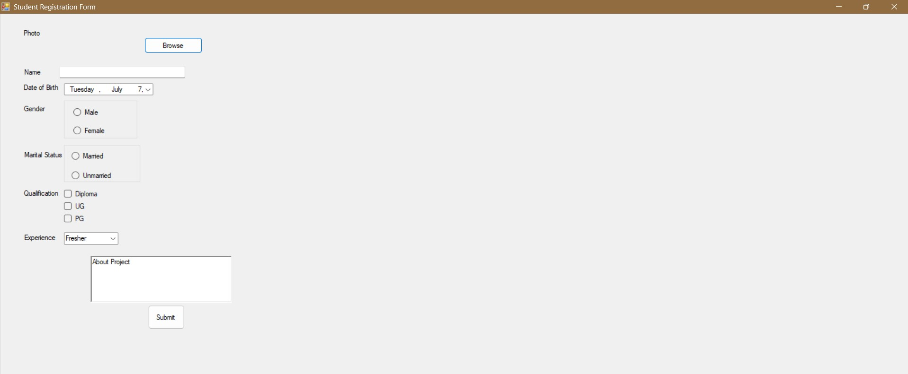
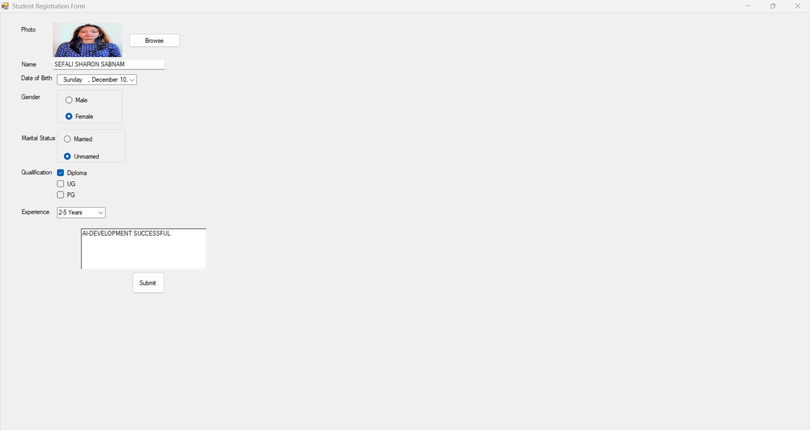

# Student Registration Form (Windows Forms)

A simple Student Registration Form developed using **C# Windows Forms (.NET Framework)**.

##  Project Description

The **Student Registration Form** is a desktop application developed using **C# Windows Forms (.NET Framework)** in **Visual Studio 2026**. It provides a simple interface for collecting and displaying student information through commonly used Windows Forms controls.

The application allows users to upload a profile photo, enter personal details such as name and date of birth, select gender, marital status, qualifications, work experience, and describe their project. After clicking the **Submit** button, all entered information is displayed in a MessageBox, demonstrating event handling, user input processing, and basic form validation in Windows Forms.

This project is designed as a beginner-friendly application to understand the fundamentals of **GUI development**, **event-driven programming**, and the practical use of Windows Forms controls in C#.

---

##  Project Objectives

- Develop a user-friendly Windows desktop application.
- Learn the fundamentals of Windows Forms development.
- Understand event-driven programming in C#.
- Practice working with common Windows Forms controls.
- Implement image upload using `OpenFileDialog`.
- Collect and display user information dynamically.
- Build a strong foundation for advanced desktop application development.

---

## Features

- Upload profile photo
- Browse image using OpenFileDialog
- Enter Name
- Select Date of Birth
- Select Gender
- Select Marital Status
- Select Qualification
- Choose Experience
- About Project
- Display all details using MessageBox

##  Technologies Used

- **Language:** C#
- **Framework:** .NET Framework 4.7.2
- **IDE:** Visual Studio 2026
- **Application Type:** Windows Forms Desktop Application
- **Concepts:** Event Handling, GUI Design, Object-Oriented Programming (OOP)

---

##  Windows Forms Controls Used

| Control | Purpose |
|---------|---------|
| Label | Display field names |
| TextBox | Enter student name |
| PictureBox | Display uploaded photo |
| Button | Browse image and submit form |
| DateTimePicker | Select date of birth |
| GroupBox | Organize related controls |
| RadioButton | Select gender and marital status |
| CheckBox | Select qualifications |
| ComboBox | Select experience |
| RichTextBox | Enter project description |
| OpenFileDialog | Browse image from computer |
| MessageBox | Display entered details |

---

## Screenshots

## Main Form

## Output

---
##  Debugging / Troubleshooting

### 1. Picture is not displayed after browsing
- Verify the selected file is a valid image (`.jpg`, `.jpeg`, `.png`, `.bmp`).
- Set the PictureBox **SizeMode** to **Zoom** or **StretchImage**.

### 2. ComboBox is empty
- Ensure the experience items are added in the `Form_Load` event.
- Verify that the `Form_Load` event is connected to the form.

### 3. Submit button does not display correct information
- Check that all control names in the code match the names in the Designer.
- Ensure the Submit button's **Click** event is assigned correctly.

### 4. Browse button is not working
- Verify that the Browse button's **Click** event is connected.
- Check that `OpenFileDialog` is implemented correctly.

### 5. Project does not run
- Build the solution (`Ctrl + Shift + B`) to check for compilation errors.
- Ensure the project is set as the **Startup Project**.
- Verify that `Application.Run(new Form1());` is present in `Program.cs`.

### 6. GitHub screenshots are not visible
- Confirm that the image filenames exactly match those referenced in `README.md`.
- Verify that the images are inside the `Screenshots` folder.
- Commit and push the image files to GitHub.

---

## Author

**Sefali**
